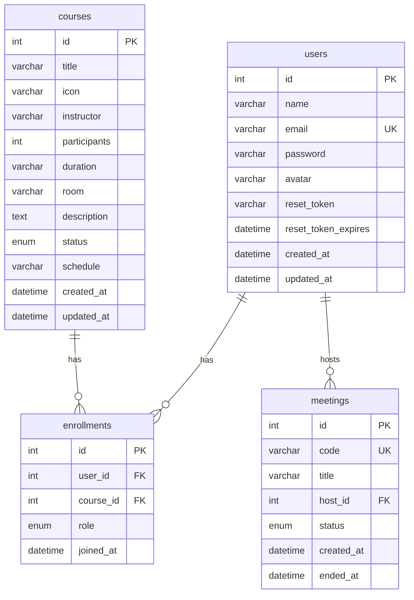
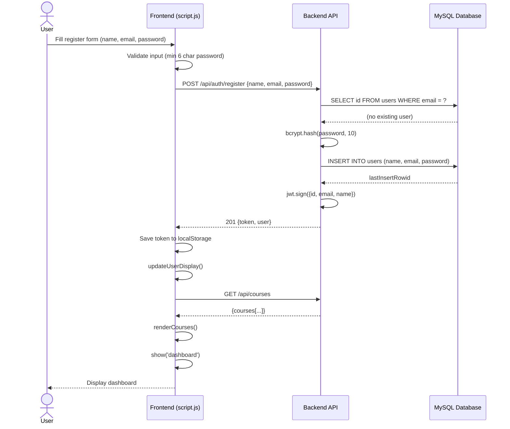
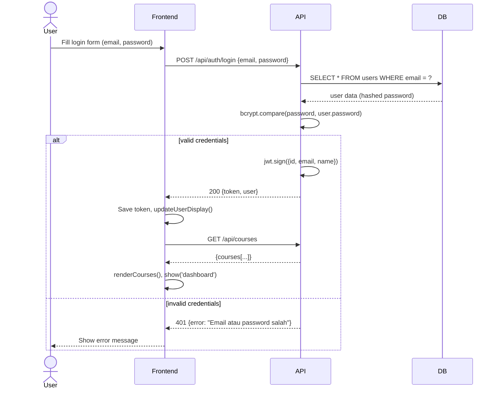
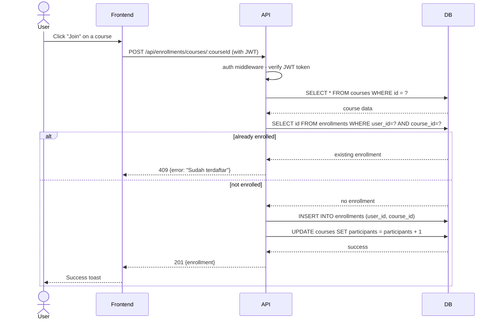
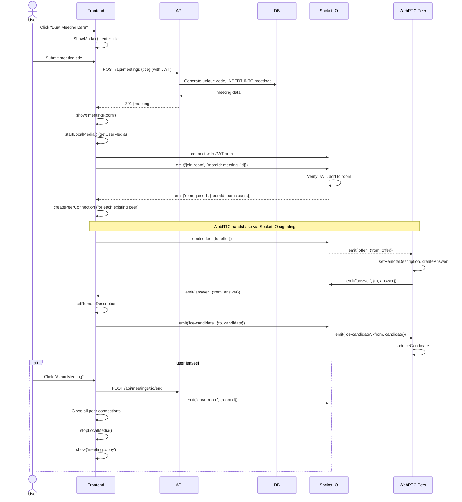
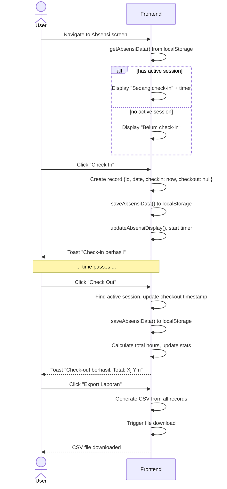
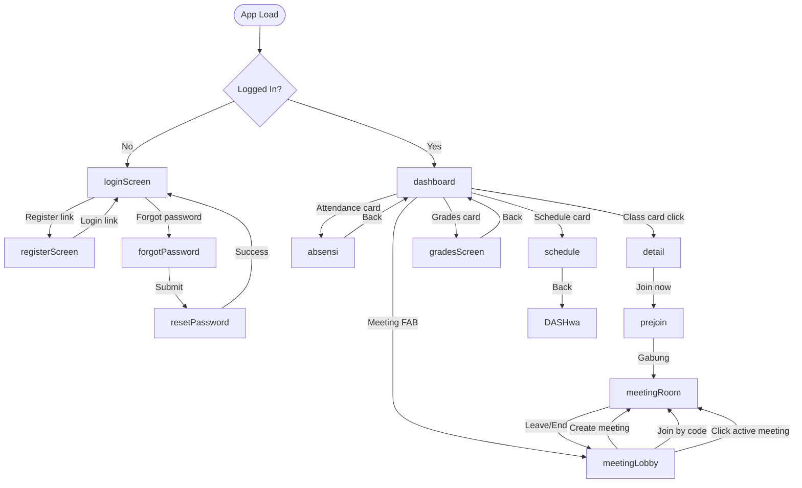

# UML Diagrams — Virtual Campus

---

## 1. Use Case Diagram

```mermaid
graph TB
    subgraph "Virtual Campus System"
        UC1[Register Account]
        UC2[Login]
        UC3[Forgot/Reset Password]
        UC4[View Dashboard]
        UC5[Search & Filter Courses]
        UC6[View Course Details]
        UC7[Enroll in Course]
        UC8[Unenroll from Course]
        UC9[Create Meeting]
        UC10[Join Meeting via Code]
        UC11[View Active Meetings]
        UC12[Manage Mic/Cam in Meeting]
        UC13[View Schedule]
        UC14[View Grades & Transcript]
        UC15[Check-in Attendance]
        UC16[Check-out Attendance]
        UC17[Export Attendance Report]
        UC18[View Notifications]
        UC19[Manage Profile]
        UC20[Change Language]
        UC21[Toggle Dark Mode]
    end

    User((User / Mahasiswa / Dosen)) --> UC1
    User --> UC2
    User --> UC3
    User --> UC4
    User --> UC5
    User --> UC6
    User --> UC7
    User --> UC8
    User --> UC9
    User --> UC10
    User --> UC11
    User --> UC12
    User --> UC13
    User --> UC14
    User --> UC15
    User --> UC16
    User --> UC17
    User --> UC18
    User --> UC19
    User --> UC20
    User --> UC21
```



---

## 2. Entity Relationship Diagram (Database)



---

## 3. System Architecture / Component Diagram

```mermaid
graph TB
    subgraph "Frontend (Browser)"
        HTML[index.html]
        CSS[style.css]
        JS[script.js]
        LANG[lang/*.json]
        subgraph "JS Modules"
            AUTH[auth logic<br/>login/register]
            UI[screen navigation<br/>dashboard/detail]
            MEDIA[media devices<br/>mic/cam]
            MEET[WebRTC<br/>meeting room]
            NOTIF[notifications]
            ABSEN[attendance]
            SCHED[schedule]
            GRADE[grades]
            I18N[i18n translations]
            DARK[dark mode]
        end
    end

    subgraph "Backend (Node.js + Express)"
        API[HTTP API<br/>port 3001]
        SOCKET[Socket.IO<br/>WebRTC Signaling]
        subgraph "Routes"
            R_AUTH[/api/auth]
            R_COURSES[/api/courses]
            R_ENROLL[/api/enrollments]
            R_MEET[/api/meetings]
        end
        subgraph "Controllers"
            C_AUTH[authController]
            C_COURSE[courseController]
            C_ENROLL[enrollmentController]
            C_MEET[meetingController]
        end
        subgraph "Middleware"
            M_AUTH[auth.js<br/>JWT verification]
            M_ERR[errorHandler.js]
        end
        DB_CONFIG[database.js<br/>MySQL pool]
    end

    subgraph "Database (MySQL/MariaDB)"
        DB[(virtual_campus)]
        USERS[users]
        COURSES[courses]
        ENROLLMENTS[enrollments]
        MEETINGS[meetings]
    end

    HTML --> CSS
    HTML --> JS
    JS --> API
    JS --> SOCKET
    JS --> AUTH
    JS --> UI
    JS --> MEDIA
    JS --> MEET
    JS --> NOTIF
    JS --> ABSEN
    JS --> SCHED
    JS --> GRADE
    JS --> I18N
    JS --> DARK

    API --> R_AUTH
    API --> R_COURSES
    API --> R_ENROLL
    API --> R_MEET
    API --> M_ERR

    R_AUTH --> C_AUTH
    R_COURSES --> C_COURSE
    R_ENROLL --> C_ENROLL
    R_MEET --> C_MEET

    R_AUTH --> M_AUTH
    R_COURSES --> M_AUTH
    R_ENROLL --> M_AUTH
    R_MEET --> M_AUTH

    C_AUTH --> DB_CONFIG
    C_COURSE --> DB_CONFIG
    C_ENROLL --> DB_CONFIG
    C_MEET --> DB_CONFIG

    DB_CONFIG --> DB
    DB --> USERS
    DB --> COURSES
    DB --> ENROLLMENTS
    DB --> MEETINGS
```

---

## 4. Sequence Diagrams

### 4.1 Authentication Flow (Register)



### 4.2 Login Flow



### 4.3 Course Enrollment Flow



### 4.4 Meeting Creation & Join Flow



### 4.5 Attendance Flow (Check-in / Check-out)



---

## 5. Navigation / Screen Flow (Frontend)



---

## 6. Frontend Module Structure

```mermaid
graph LR
    subgraph "script.js - IIFE"
        STATE[auth state<br/>authToken, authUser]
        NAV[navigation<br/>show(), history]

        subgraph "API Layer"
            API[api() helper]
            AUTH_FN[handleLogin<br/>handleRegister]
            CRUD[loadDashboard<br/>createMeeting<br/>getMeetingByCode]
        end

        subgraph "UI Components"
            RENDER[renderCourses<br/>populateDetail]
            MODAL[showModal<br/>hideModal]
            TOAST[toast]
            SKELETON[showSkeleton<br/>hideSkeleton]
        end

        subgraph "Features"
            MEDIA[startMic/stopMic<br/>startCam/stopCam]
            MEET[enterMeetingRoom<br/>leaveMeeting<br/>WebRTC logic]
            NOTIF[notifications panel<br/>mock data]
            ABSENSI[checkin/checkout<br/>localStorage]
            SCHEDULE[scheduleData<br/>renderSchedule]
            GRADES[gradesData<br/>renderGrades]
        end

        subgraph "Utilities"
            I18N[t() translations<br/>updateI18n]
            CLOCK[tickClock]
            SEARCH[search + filter chips]
            DARK[dark mode toggle]
        end
    end
```
